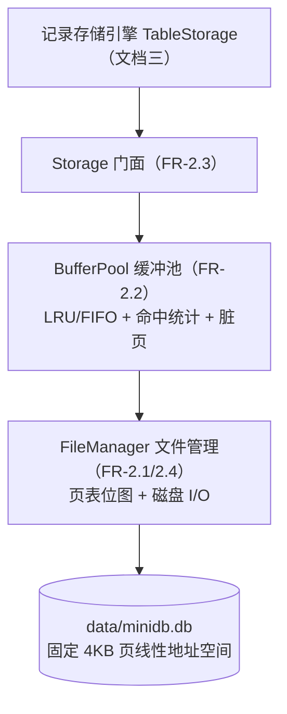
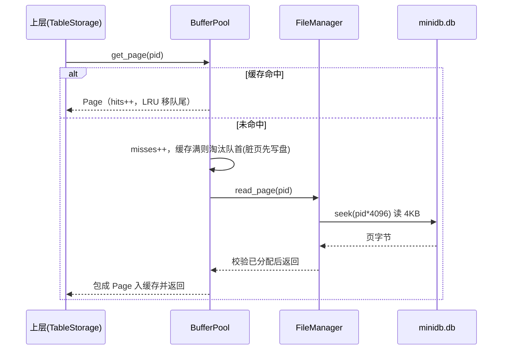

# 文档二（辅助功能一）：页式存储子系统
## —— 固定 4KB 页、LRU/FIFO 缓冲池、页表与 Checkpoint 持久化

> 答辩分工：本文档是**辅助文档**，负责系统最底层的**物理存储子系统（`storage/` 包）**，对应需求 FR-2.1 ~ FR-2.4。它向上为主链路（文档一）和记录存储引擎（文档三）提供「按页读写 + 缓存 + 持久化」能力，本身不理解 SQL、也不理解「行/表」。
>
> **负责的源码模块**：
> - `storage/page.py`：页模型与跨页分段工具；
> - `storage/file_manager.py`：磁盘文件、空闲页位图页表、页分配/释放/磁盘读写；
> - `storage/buffer.py`：页缓冲池、LRU/FIFO 替换、命中统计、脏页刷盘；
> - `storage/__init__.py`：统一门面 `Storage`（FR-2.3）；
> - `storage/errors.py`：6 类存储错误。

---

## 1. 定位与分层

存储子系统在整体架构中的位置：



三层职责一句话概括：
- **Page（页）**：磁盘 I/O 的最小单位，固定 4KB；
- **FileManager（文件管理）**：把一个 `.db` 文件组织成「第 0 页页表 + 若干数据页」的线性页空间，负责分配/释放/真实读写；
- **BufferPool（缓冲池）**：在内存里缓存有限数量的页，按 LRU/FIFO 替换，统计命中率，统一脏页刷盘；
- **Storage（门面）**：组合上面两者，对上暴露一套一致接口。

---

## 2. 页模型 Page（page.py，FR-2.1）

### 2.1 固定大小页

- 常量 `PAGE_SIZE = 4096`（4KB）；`META_PAGE_ID = 0`（**第 0 页保留给页表**，用户不可分配）。
- `Page` 用 `__slots__` 精简内存，含三要素：`page_id`、`data`（bytearray）、`dirty`（脏标记）。
- 构造时：数据超过 4KB 抛 `DataTooLarge`；**不足 4KB 自动补零**，保证物理页恒为 4KB；`mark_dirty()` 置脏，供 Checkpoint 判断是否需要写盘。

### 2.2 大块数据跨页工具（TC-ST-02）

- `split_into_pages(data, page_size)`：把任意长度字节流按 4KB 切片（空数据也返回一个空块，保证至少占一页）；
- `combine_pages(chunks)`：按序拼回原始数据。
- 上层（文档三的行、目录 blob）遇到超过一页的内容，就用这对函数实现「跨页存储 / 还原」。

---

## 3. 磁盘文件管理 FileManager（file_manager.py，FR-2.1 / FR-2.4）

### 3.1 文件布局：页 0 是「页表」，其余是数据页

数据库文件 `data/minidb.db` 是固定 4KB 页的线性地址空间，第 `pid` 页的字节偏移就是 `pid * 4096`。**第 0 页专门存页表**，布局为：

```
页 0（4KB）
 +0  8 字节   struct ">II"：page_count（总页数）、free_count（空闲页数）
 +8  N 字节   空闲位图：第 i 个 bit = 1 表示「第 i 页空闲可复用」，N = ceil(page_count/8)
 其余         全 0
```

- 位图操作：`_is_free / _set_free / _clear_free`（用 `divmod(pid,8)` 定位字节与位）；
- 位图容量上限：`(4096-8)*8 = 32704` 页，超出抛 `PageTableFull`，对教学原型足够。

### 3.2 打开/创建与页表恢复

构造时：`os.makedirs` 确保目录存在；文件不存在就建空文件并以 `r+b` 打开。
- **新库**（文件大小为 0）：`page_count=1`（只有页 0）、`free_count=0`，写回初始页表；
- **已有库**：`_load_meta()` 从页 0 读回 `page_count/free_count/位图`，完成重启后的页空间恢复；页表头/位图长度不对会抛 `IOError（corrupted page table）`。

### 3.3 页的分配与释放（TC-ST-01 / TC-ST-06）

- `allocate_page()`：**优先复用**空闲页（`_find_first_free` 从页 1 起找第一个位图为 1 的页，清位、free_count-1）；没有空闲页时走 `allocate_new_page()` 在文件末尾追加。每次分配都 `_store_meta()` **即时把页表写回磁盘**。
- `allocate_new_page()`：在文件末尾**强制追加**一个全新页，页号恰好等于当前 `page_count`（保证按序分配时页号连续），并在文件中 `seek + 写 4KB 零` 预留空间。它专门服务于「需要连续页区」的上层——文档三的系统目录区（页 1~16）就是用它预分配的。
- `release_page(pid)`：校验页合法、**页 0 禁止释放**（抛 `InvalidPageId`）、不能重复释放（抛 `PageNotAllocated`），然后置空闲位、free_count+1 并即时写回页表。被释放的页之后可被 `allocate_page` 再次分配，实现空间回收复用。

### 3.4 磁盘读写（模拟磁盘 I/O）

- `read_page(pid)`：先 `_check_allocated`（越界抛 `PageOutOfRange`、读已释放页抛 `PageNotAllocated`），再 `seek(pid*4096)` 读满 4KB（短读抛 IOError）。
- `write_page(pid, data)`：超长抛 `DataTooLarge`、校验已分配、不足补零、定位写入并 `flush()` 落盘。
- `close()`：关闭前再写一次页表，保证元数据持久。

> 注意区分：`FileManager.read_page/write_page` 是**直接磁盘 I/O**；带缓存的访问走下一节的 BufferPool。

---

## 4. 页缓冲池 BufferPool（buffer.py，FR-2.2）

缓冲池位于 FileManager 之上，用固定容量的内存缓存减少磁盘访问，并提供命中率统计与替换日志。

### 4.1 数据结构与两种替换策略

缓存容器统一使用 `collections.OrderedDict`（保持顺序），容量 `capacity`（默认 8），策略 `LRU/FIFO` 可在构造时指定、也可 `set_policy()` **运行时热切换且不丢缓存内容**。两种策略用同一容器优雅实现：

| 策略 | 命中时 | 淘汰时（统一 `popitem(last=False)` 取队首） |
| --- | --- | --- |
| **LRU** 最近最少使用 | `move_to_end(pid)` 把命中页移到队尾，使顺序变成「访问序」 | 淘汰队首 = 最久未访问的页 |
| **FIFO** 先进先出 | 不动顺序，保持「插入序」 | 淘汰队首 = 最早进入缓存的页 |

构造期会校验 `capacity>0`、`policy∈{LRU,FIFO}`，非法即抛 `ValueError`。

### 4.2 取页与淘汰流程（get_page）

```
get_page(pid):
  命中（在缓存）：hits++，LRU 时 move_to_end，直接返回 Page
  未命中：misses++
     若缓存已满 → _evict_one() 先淘汰一个
     从 FileManager.read_page 读盘 → 包成 Page 放入缓存 → 返回
```

`_evict_one()` 淘汰队首页时，**若该页是脏页必须先 write_page 刷盘**（否则修改丢失），然后 `evictions++`，并按开关写一条替换日志，如 `LRU evict page 2 (dirty)`。

### 4.3 写、刷盘与失效

- `write_page(pid,data)`：经 `get_page`取到页后覆盖其 data、补零到 4KB 并 `mark_dirty`——**写操作先落缓存、延迟刷盘**；超长抛 `DataTooLarge`。
- `mark_dirty(pid)`：取页后只置脏（适用于「取出页直接改 data」的场景，文档三大量使用）。
- `flush_page(pid)`（TC-ST-05）：把指定脏页写回磁盘并清脏标记。
- `flush_all()/checkpoint()`（FR-2.4）：遍历缓存把**所有脏页**写盘并清脏，返回刷盘页数；`checkpoint` 是 `flush_all` 的语义别名。
- `invalidate_page(pid)`：把页从缓存移除（脏页先刷盘）。**它是保证缓存一致性的关键**：文档三释放某页前必须先 invalidate，否则该页号被重新分配时可能命中缓存里的过期内容。

### 4.4 统计与可观测（FR-2.2）

维护 `hits / misses / evictions` 计数与 `eviction_log`：
- `hit_rate` 命中率 = `hits/(hits+misses)`，无访问记录时为 0；
- `cached_page_ids()/dirty_page_ids()` 查询缓存页/脏页；
- `stats()` 返回 `policy/capacity/cached/hits/misses/evictions/hit_rate/dirty_pages` 的完整字典，一路向上贯通到 CLI 的 `stats` 命令和 Web 的 `/api/stats`（文档四）。

---

## 5. 统一门面 Storage（storage/__init__.py，FR-2.3）

`Storage` 组合 `FileManager + BufferPool`，对上层提供唯一入口，接口分四组：

| 分组 | 方法 | 说明 |
| --- | --- | --- |
| 页分配/释放/直读 | `allocate_page / allocate_new_page / release_page / read_page` | 直接转发 FileManager（read_page 为绕过缓存的磁盘直读） |
| 带缓存访问 | `get_page / write_page / mark_dirty / flush_page / invalidate_page` | 转发 BufferPool |
| 批量刷盘 | `flush_all / checkpoint` | Checkpoint 全量脏页刷盘 |
| 统计/策略/生命周期 | `hit_rate / eviction_log / stats / set_policy / close` | close = 先 flush_all 再 FileManager.close |

典型用法（README 示例）：

```python
st = Storage(data_dir="data", capacity=8, policy="LRU")
pid = st.allocate_page()        # 分配（页号唯一，页 0 保留）
st.write_page(pid, b"hello")    # 写缓存并标脏，不足 4KB 自动补零
page = st.get_page(pid)         # 带缓存取页（命中/读盘）
st.checkpoint()                 # 全部脏页刷盘
print(st.stats())               # 命中率等统计
st.close()                      # 关闭前自动刷盘 + 写回页表
```

支持 `with Storage(...) as st` 上下文自动关闭。

---

## 6. 持久化是如何保证的（FR-2.4 串讲）

系统从三个层面保证「程序重启后数据不丢」：

1. **页表持久化**：每次分配/释放都立刻把 `(page_count, free_count, 位图)` 写回页 0；重启时 `_load_meta` 还原整个页空间的分配状态。
2. **数据页持久化**：写操作先进入缓冲池并标脏，由 `flush_page`（单页）或 `checkpoint/flush_all`（全量）刷盘；缓冲池淘汰脏页时也会先刷盘。
3. **关闭兜底**：`Storage.close()` 先全量刷脏页、再写回页表并关闭文件句柄；即使上层异常，文档三/CLI 也会在 finally 中调用 close。

读流程时序（未命中并触发淘汰的典型场景）：



---

## 7. 存储错误体系（storage/errors.py）

统一基类 `StorageError`，`str()` 格式为 `[错误类型] 原因`，共 6 个子类，全部可被上层捕获、保证非法操作不崩溃：

| 错误类型 | 触发场景 |
| --- | --- |
| `InvalidPageId` | 非法页号（如试图释放保留页 0） |
| `PageOutOfRange` | 页号越界（pid<0 或 ≥page_count） |
| `PageNotAllocated` | 读写/释放「已释放或未分配」的页、重复释放 |
| `PageAlreadyAllocated` | 页重复分配（防御性） |
| `DataTooLarge` | 写入数据超过单页 4KB（应改走跨页分段） |
| `PageTableFull` | 页 0 位图容量耗尽（超过 32704 页） |

它与编译错误（`SQLError`，文档一）、引擎错误（`EngineError`，文档三）构成三层错误体系，汇总见文档四。

---

## 8. 测试对应（tests/test_storage.py，共 28 个测试函数）

| 需求/用例 | 覆盖点 |
| --- | --- |
| TC-ST-01 | 分配页号唯一、写入读回一致、默认页零填充 |
| TC-ST-02 | 单页写超长报错；超大块用 split/combine 跨多页正确还原；空数据占一页 |
| TC-ST-03 | LRU 淘汰顺序、命中率统计、淘汰日志与脏标记 |
| TC-ST-04 | FIFO 淘汰顺序、FIFO 与 LRU 行为差异、`set_policy` 切换保留缓存 |
| TC-ST-05 | flush_page 落盘且清脏、checkpoint 刷全部脏页 |
| TC-ST-06 | 释放页可再分配、空闲列表记录多次释放 |
| 持久化 | 重开文件数据保留、close 时脏页落盘 |
| 异常/健壮 | 越界读、读已释放页、禁止释放页 0、重复释放报错 |
| 门面 | Storage 转发策略/命中率、mark_dirty+flush_all、with 语句 |

此外 `test_boundary.py` 还覆盖了缓存容量必须为正、策略非法拒绝、容量为 1 时降级运行、页大小精确边界等边界用例（详见文档四）。

---

## 9. 答辩可能被问到的问题（存储方向）

1. **为什么固定 4KB 页？为什么第 0 页要保留？**
   4KB 是操作系统常见页/块大小，定长页让「页号→文件偏移」成为简单乘法、便于缓存与回收；第 0 页集中存放页表（总页数 + 空闲位图），使分配状态本身可持久化、重启可恢复。
2. **LRU 和 FIFO 在代码里怎么区分？**
   都用 OrderedDict、都从队首 `popitem(last=False)` 淘汰；唯一差别是**命中时 LRU 会 move_to_end、FIFO 不动**，于是同一个队首在 LRU 是「最久没访问」、在 FIFO 是「最早进入」。
3. **淘汰脏页时为什么要先写盘？**
   脏页含有尚未落盘的修改，直接丢弃会丢数据，所以 `_evict_one` 检测到 dirty 必须先 write_page 再移除。
4. **释放页前为什么要 invalidate_page？**
   防止「页号被释放后又重新分配给别的数据」时，缓冲池仍返回该页号对应的旧缓存，造成读到过期数据；先 invalidate（脏则刷盘）可保证下次从磁盘读新内容。
5. **空间是怎么回收复用的？**
   `release_page` 在页表位图中把该页标记为空闲，`allocate_page` 优先从位图找空闲页复用，找不到才在文件末尾追加新页。
6. **宕机/重启后为什么数据还在？**
   页表在每次分配/释放时即时写回页 0，数据页由 flush/checkpoint/淘汰/关闭多条路径刷盘，重启时 FileManager 读回页表、CatalogManager（文档三）读回目录，即可恢复表结构、页集合与行数据。
